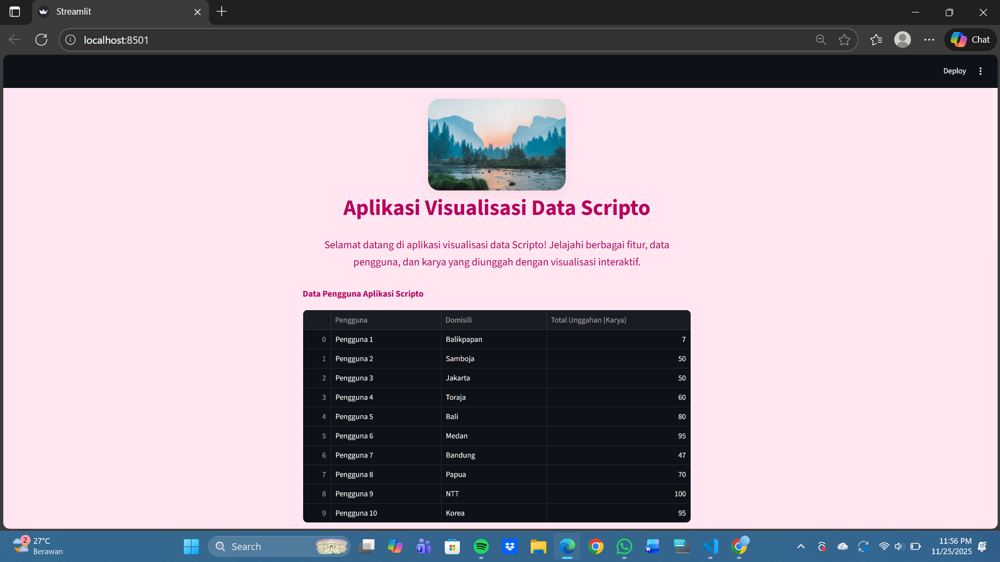
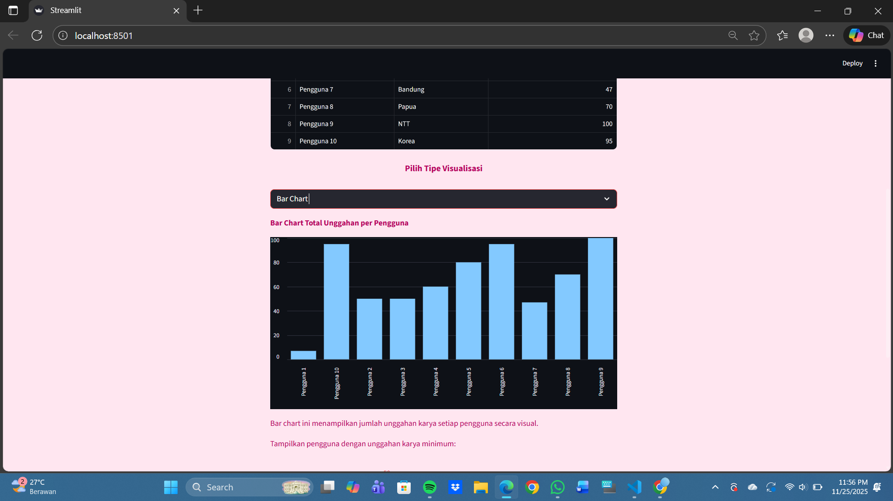
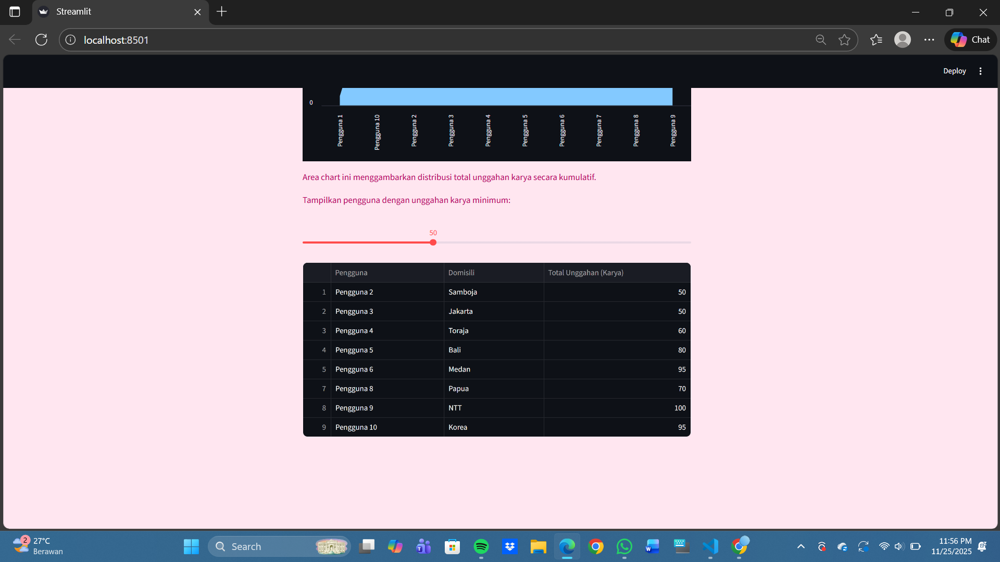

# Kesimpulan & Dokumentasi Proyek: Visualisasi Data Pengguna Aplikasi Scripto

Debora Intania Subekti | 10231029 | ABD A
## Deskripsi Singkat
Visualisasi ini dibuat menggunakan Streamlit untuk memvisualisasikan data pengguna dan karya yang diunggah pada Scripto, yang dirancang dan dibangun oleh penulis. Tampilan didesain dengan nuansa pink yang estetik dan interaktif, serta dilengkapi berbagai jenis chart dan peta domisili pengguna berdasarkan data masukan yang ada terdiri dari 3 column dan 10 row.

---

## Step by Step Pembuatan

### 1. Persiapan Lingkungan
- Membuat environment Conda baru (opsional) dan menginstall package yang dibutuhkan:
  - `streamlit`, `pandas`, `matplotlib`, `numpy`
- Memastikan environment lokal sudah mendukung adanya instalasi conda.
- Memastikan interpreter Python di VS Code sudah sesuai environment.

### 2. Desain Tampilan
- Menambahkan custom CSS untuk background pink dan warna judul.
- Menampilkan header gambar dari internet

### 3. Memasukkan Data
- Membuat dataframe berisi 10 pengguna, domisili, dan total unggahan karya.
- Menampilkan data dalam tabel yang center dan rapi dengan 3 column dan 10 row.

### 4. Dropdown Visualisasi
- Membuat dropdown untuk memilih tipe chart:
  - Pie Chart
  - Bar Chart
  - Line Chart
  - Map Chart
  - Area Chart
- Setiap chart diberi judul dan penjelasan dengan warna pink gelap.

### 5. Pie Chart
- Pie chart dibuat lebih elegan dengan warna pastel dan label persentase di luar slice. Tidak ada bolongan di tengah, sehingga tampil sebagai pie chart solid.

### 6. Bar, Line, Area Chart
- Visualisasi jumlah unggahan karya per pengguna dengan chart yang interaktif dan stylish.

### 7. Map Chart
- Menampilkan peta domisili pengguna menggunakan latitude dan longitude berdasarkan domisili pengguna.

### 8. Slider Filter
- Menambahkan slider untuk memfilter pengguna berdasarkan jumlah unggahan karya minimum.

---

## Kesimpulan
Visualisai ini berhasil menampilkan data pengguna dan karya dengan visualisasi yang menarik dan mudah dipahami. Setiap fitur didesain agar user-friendly dan estetik, mulai dari header, tabel, chart, hingga peta. Proses pembuatan meliputi setup environment, desain UI, pembuatan data, dan integrasi visualisasi interaktif. 

Selain itu, visualisasi ini juga cocok untuk demo, tugas, maupun pengembangan dashboard data sederhana berbasis Python dan Streamlit.

---

## Saran Pengembangan
- Integrasi data real dari database.
- Penambahan fitur upload data.
- Customisasi chart lebih lanjut (warna, animasi, dsb).
- Responsif untuk mobile.

---

## Dokumentasi

